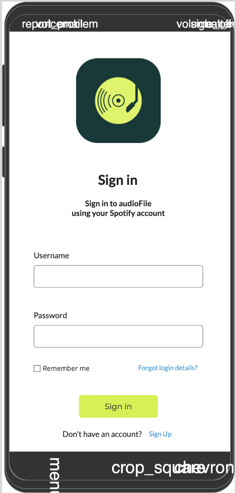
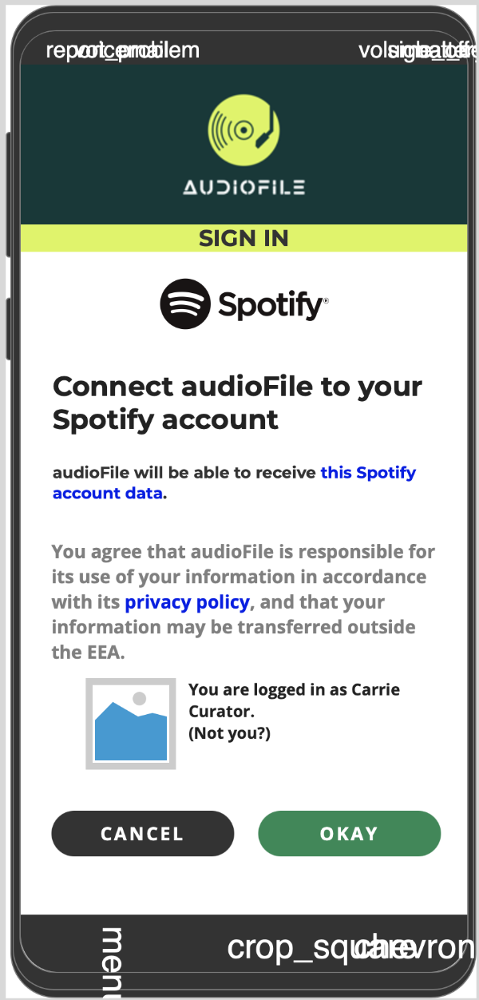
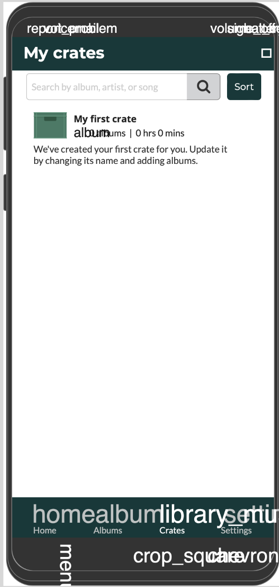
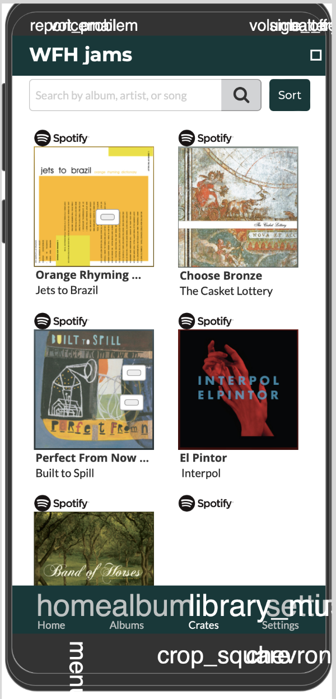
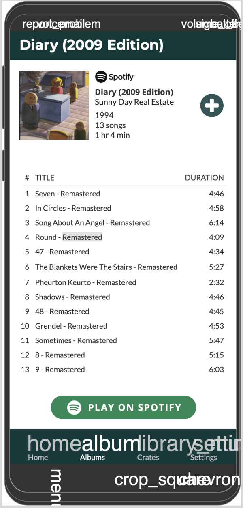

# audioFile

## Overview

Does anyone still listen to full albums anymore? audioFile allows those who do
to build their own collections (crates) of albums — linked directly to their
Spotify profile.

This is supposed to be a "native" app, but I am building it as a web app
(mobile-only view).

<!-- will deploy with Capacitator -->

### Problem

<!-- Why is your app needed? Background information around any pain points or other
reasons. -->

Spotify is the premier platform for discovering new music. However, all of the
cataloging functionality focuses on single songs. There is no way for an
album-listener (TM) to intuitively organize, shuffle-play, or view their most
beloved records. This functionality has been requested on multiple ocasions in
Spotify forums.

### User Profile

<!-- Who will use your app? How will they use it? Any special considerations that
your app must take into account. -->

- Carrie Curator considers herself the hostest with the mostest. She is
  constantly opening her home to guest - and the vibe must always be immaculate
  (down to the perfect tunes).

- Organized Olivia enjoys puzzles, jogging, and visiting museums — all on a
  schedule of course. They always finds ways to compartmentalize and sort things
  in their life.

- Reco Randy went to school for engineering, but always spent more time looking
  for new more music than studying. He's always got the perfect new artist to
  recommend to a friend, or even stranger!

### Features

<!-- List the functionality that your app will include. These can be written as user
stories or descriptions with related details. Do not describe _how_ these
features are implemented, only _what_ needs to be implemented. -->

- create audioFile account
- authenticate with Spotify account
- have a defualt crate
- create/remove a crate (i.e., collection of albums)
- add/remove an album to/from crate
- search Spotify for albums
- add/remove album to/from Spotify library
- sort crates by date added, name, artists
- find crate by artist, song, album
- view album details (track list, cover art, metadata)
- pin/unpin crate to/from top of list

## Implementation

### Tech Stack

<!-- List technologies that will be used in your app, including any libraries to save
time or provide more functionality. Be sure to research any potential
limitations. -->

- react
- react-router-dom
- mysql
- knex
- node
- express
- cors
- axios
- fuse.js

### APIs

<!-- List any external sources of data that will be used in your app. -->

Spotify

### Sitemap

<!--
List the pages of your app with brief descriptions. You can show this visually,
or write it out. -->

#### ~ Crates page

This is where your crates (album collections) live. From here you can navigate
to an individual crate or to the search page.

#### ~ Crate Details page

This is where your albums within a given crate (album collection) live. From
here you can edit your crate, navigate to an individual album, create a new
crate or go to search page.

#### ~ Album page (modal)

View the details of a specific album.

#### ~ add crate page (modal)

Make a new crate, give it a name

#### ~ Edit crate page (modal)

Change the name, add / remove albums

#### ~ Discovery page

Search for albums on Spotify

#### ~ Login page

Login in to audioFile account

#### ~ Signup page

Create audioFile account

#### ~ Spotify authentication page

Give audioFile permission to connect to your Spotify account

### Mockups

<!-- Provide visuals of your app's screens. You can use tools like Figma or pictures
of hand-drawn sketches. -->

### Data

<!-- Describe your data and the relationships between them. You can show this
visually using diagrams, or write it out. -->

#### ~ user table

- id (primary key, incremented)
- username (string)
- email (string)
- password (string)
- whatever spotify tokens are required for auth

#### ~ crate table

- id (primary key, incremented)
- user_id (foreign key)
- name (string, default to "my crate #<id>")
- cover_art (static link)
- album_id
- empty_crate (boolean, default to true)
- created_at (timestamp, default to now)
- updated_at (timestamp, default to now, change with every update)

#### ~ crate_album table

- crate_id
- album_id

### Endpoints

<!-- List endpoints that your server will implement, including HTTP methods,
parameters, and example responses. -->

#### METHOD ... URL ... DESCRIPTION

- GET ... /users/17/crates ... get all crates for user 17
- POST ... /users/17/crates ... create a new crate for user 17
- GET ... /users/17/crates/51 ... get crate 51 for user 17
- PATCH ... /users/17/crates/51 ... update crate 51 for user 17
- DELETE ... /users/17/crates/51 ... delete crate 51 for user 17

- GET ... /users/17/crates/51/albums ... get all albums in crate 51 for user 17
- POST ... /users/17/crates/51/albums ... add album(s) to crate 51 for user 17
- DELETE ... /users/17/crates/51/albums/23 ... remove album 23 from crate 51 for
  user 23

- GET ... /albums/23 ... get album 23 (with tracklist)

- GET ... /search ... **use spotify api, not db** to get all albums that match
  search term

### Auth

<!-- Does your project include any login or user profile functionality? If so,
describe how authentication/authorization will be implemented. -->

- Auth for audioFile user profile (create account, log in)

- Authorization Code flow to grant permission for app to make changes to Spotify
  library on behalf of user (authorize audioFile profile to use Spotify, send
  tokens with each request to Spotify)

## Roadmap

<!-- Scope your project as a sprint. Break down the tasks that will need to be
completed and map out timeframes for implementation. Think about what you can
reasonably complete before the due date. The more detail you provide, the easier
it will be to build. -->

- set up backend project structure, database & server using knex, express
- set up front end project structure using create-react-app
- create user account: build LoginPage that takes username, email, password &
  POST request to store in users table along with timestamp of account creation.
- connect Spotify account: upon login, check if spotify is authenticated, if not
  have popup that says "can't use app without being connected to Spotify" if
  they click ok route to Spotify authentication
- build Navigation at bottom of screen (home, discovery, add new crate)
- make a default crate for every new user that displays once Spotify
  authenticated
- CratesPage to view all crates
- page to send POST request for new crate. have default name. allow user to
  change. check that name is at least one character. upon successful POST
  request, navigate to crate page (where user can add an album)
- CrateDetailsPage - displays some metadata & albums. Has a search bar. Users
  can add & remove albums from here. User can edit crate name from here.
- remove crate functionality
- edit a crate page . user can change name, remove & add albums
- find a crates (by artist, track, album)
- search spotify for albums (by artist, track, album)
- AlbumPage shows album details (duration, tracklist, artists, release year)
- sort crates by recently added, recently updated, name
- sort crate contents by primary artist, album name, duration, releae year, date
  added to crate
- save an album to your Spotify library
- export a crate as a playlist
- favourite / pin a crate to top of CratesPage

## Nice-to-haves

<!-- Your project will be marked based on what you committed to in the above
document. Under nice-to-haves, you can list any additional features you may
complete if you have extra time, or after finishing. -->

- questionaire that helps build default crate (or maybe check user library /
  history)
- preview song on audioFile
- play an album in Spotify
- play albums in a crate in Spotify (in order)
- play albums in a crate in Spotify (in random order)
- add note to album
- add note to crate
- add cover image to crate
- edit crate cover image
- change user info (email, username, password)
- add user photo
- change user photo

<!-- pin icon: <a href="https://www.flaticon.com/free-icons/pin" title="pin icons">Pin icons created by Freepik - Flaticon</a> -->
